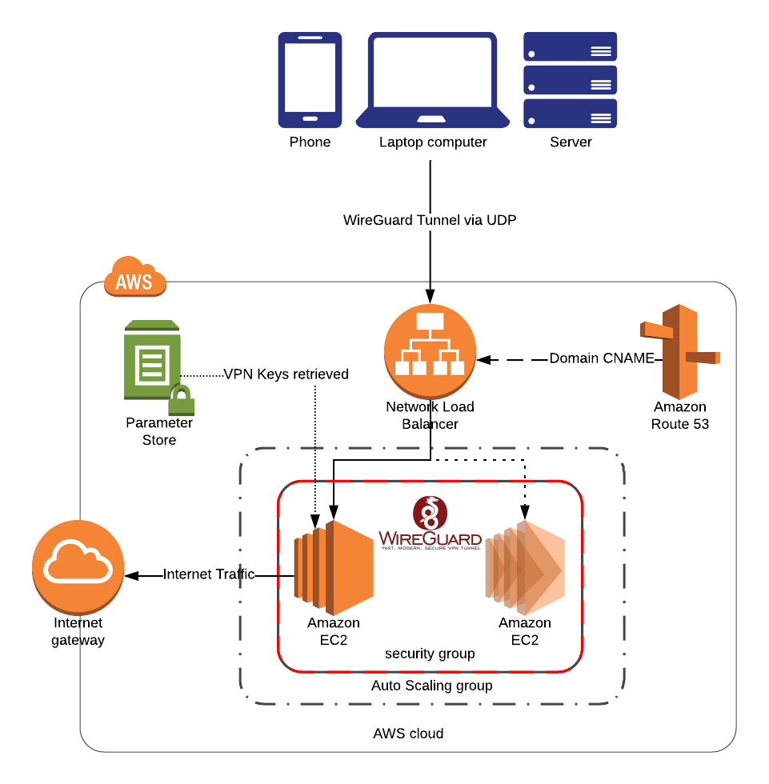

# Example: WireGuard deployed on AWS with Load Balancing
This is an example repo to demonstrate WireGuard VPN deployed on Amazon EC2 with Network Load Balancer, a Route53 Domain and Amazon Linux 2.
Keys are handled via AWS Parameter Store, encrypted with AWS KMS to prevent the need for reconfiguration when instances are scaled, updated or terminated.

*Disclaimer: provided as an example and some assumptions have been made for network layout.*

Reach out on [Reddit](https://www.reddit.com/r/WireGuard/comments/d0vjs6/ive_automated_wireguard_on_aws_with_amazon_linux/) with any queries or tips!

## Setup
  1. Generate keys for your server and peer with `wg genkey | tee privatekey | wg pubkey > publickey` then save them in encrypted SSM Parameters called `/wireguard/private` and `/wireguard/peerpublic`
  2. Set Cloudformation parameters in `config/wireguard-${your region}.json` to suit
  3. Deploy `pipeline.yml` via Cloudformation
  4. Configure and connect your peer

## Architecture

